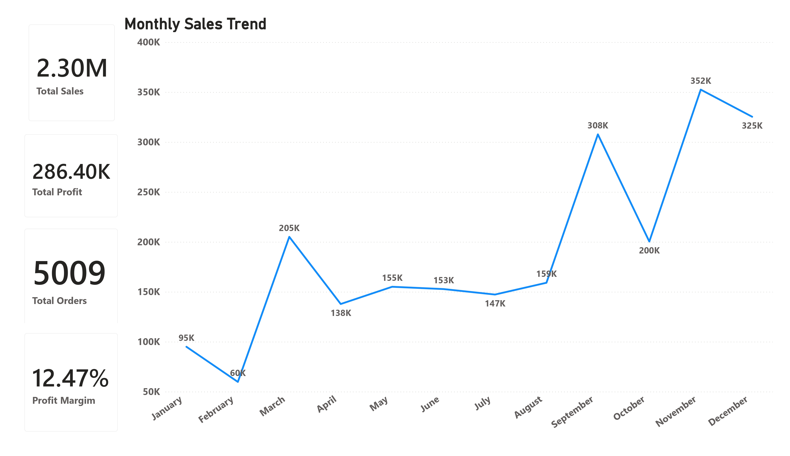
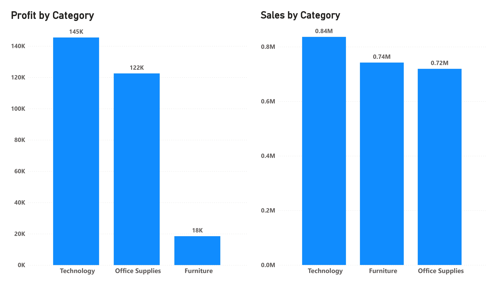
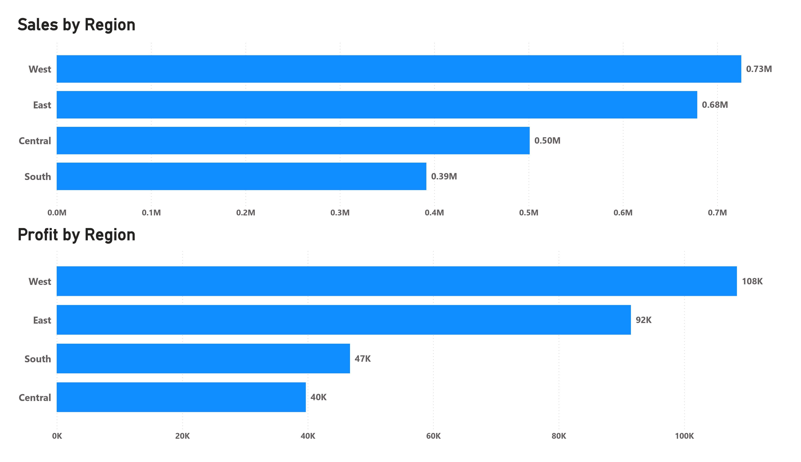
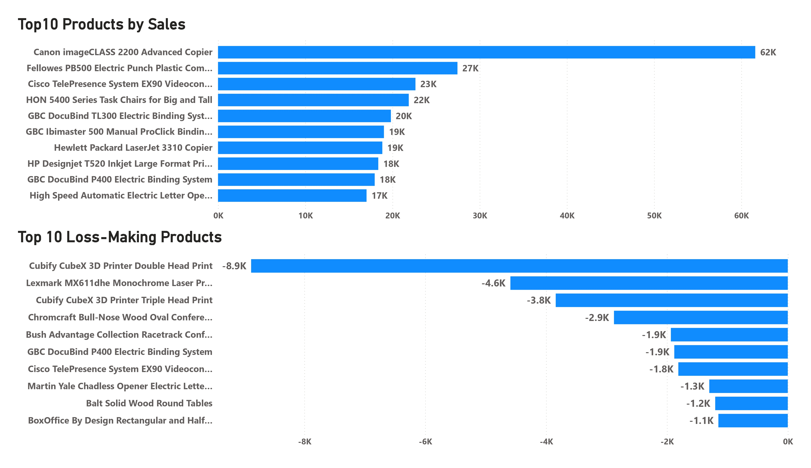
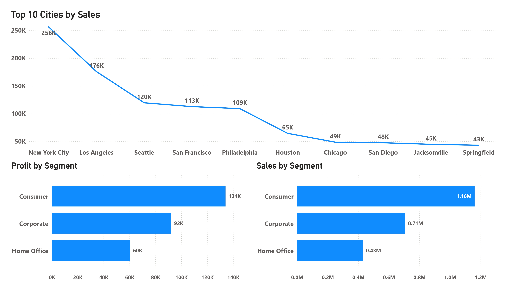

# 📊 Superstore Profitability & Discount Strategy Analysis

## 📌 Project Overview

This project analyzes sales performance, product profitability, and discount strategies using the **Superstore dataset** to uncover factors driving profit erosion and identify opportunities to improve margin performance.

The analysis focuses on identifying **loss-generating products, discount impact on profitability, and regional performance differences** in order to recommend actionable business strategies.

---

# 🎯 Business Objective

Despite generating strong revenue, the Superstore business experiences **inconsistent profitability across product categories, regions, and discount strategies**.

The objective of this project is to:

- Identify **loss-making products**
- Evaluate **discount impact on profit margins**
- Analyze **regional and category performance**
- Provide **data-driven recommendations to improve profitability**

---

# 📊 Dataset

Dataset: **Sample Superstore Dataset**

Source: Public dataset available on Kaggle.

Dataset Details:

- Period analyzed: **2014 – 2017**
- Total transactions: **9,994**
- Data type: **Transaction-level retail sales data**

Main variables include:

- Sales
- Profit
- Discount
- Product category
- Region
- Customer segment
- Order date

---

# 🛠 Technical Workflow

## 1️⃣ Data Preparation (Python)

The dataset was processed and prepared using **Python and Pandas**.

Key steps:

- Loaded dataset using **pandas**
- Converted date columns to datetime format
- Verified dataset structure and data types
- Checked dataset completeness

Example preparation steps:

- `pd.read_csv()`
- `df.info()`
- `df.dtypes`
- `pd.to_datetime()`

---

## 2️⃣ Exploratory Data Analysis

Multiple analyses were conducted to understand sales drivers and profitability patterns.

### Sales & Profit Overview

- Total sales
- Total profit
- Profit margin
- Total orders

### Time Analysis

- Yearly sales trends
- Monthly sales patterns

### Category Performance

- Sales by category
- Profit by category
- Identification of low-margin categories

### Regional Analysis

- Sales by region
- Profit by region
- Regional contribution to overall revenue

### Product Performance

- Top selling products
- Products generating significant losses

### Discount Impact

- Correlation between **Discount and Profit**
- Average profit by discount level
- Identification of **profit erosion caused by high discounts**

---

# 🔍 Key Insights

### Revenue vs Profit

High revenue does not always translate into high profitability.

The **Furniture category generates strong revenue but weak profit margins**, indicating cost or pricing inefficiencies.

---

### Discount Impact

Statistical analysis confirmed a **negative correlation between discount levels and profitability**.

Key findings:

- 0% Discount → Positive profit
- 20% Discount → Reduced profit
- 30%+ Discount → Frequent losses
- 50% Discount → Severe profit erosion

---

### Regional Performance

The **West region leads in both sales and profitability**, while other regions show weaker profit performance despite generating revenue.

---

### Loss-Generating Products

Several products consistently generate **negative profit**, highlighting the need for **SKU-level profitability monitoring**.

---

# 📊 Dashboard Visualizations

## Executive Performance Overview

---

## Category Performance Analysis

---

## Regional Performance Analysis

---

## Product Profitability Analysis

---

## Customer Segment Analysis

---

# 🧾 Python Analysis Code

All data preparation and analysis steps were performed using **Python**.

📂 Open the Python Script:

[Open Python Script](Notebooks/sales_analysis_project.py)

The script includes:

- Data loading and validation
- Feature engineering
- Profitability analysis
- Discount impact analysis
- Product loss investigation
- Data export for dashboard creation

---

# 📑 Project Presentation

A full presentation summarizing the analysis, insights, and business recommendations.

📥 Open the presentation:

[Open Presentation](Presentation/superstore_analysis_presentation..pdf)

---

# 🧠 Skills Demonstrated

- Python (Pandas, NumPy)
- Data Cleaning
- Exploratory Data Analysis
- Business KPI Analysis
- Profitability Analysis
- Discount Strategy Evaluation
- Data Visualization
- Data Storytelling
- Dashboard Design

---

# 📁 Project Structure

superstore-profitability-analysis

README.md

Images  
Executive_dashboard.jpg  
category_analysis.jpg  
customer_analysis.jpg  
product_analysis..jpg  
regional_analysis.jpg  

Notebooks  
sales_analysis_project.py  

Presentation  
superstore_anlaysis_presentation.pdf  

---

# 📬 Contact

**Amin Suleiman**  
Data Analytics Portfolio Project  
2026
